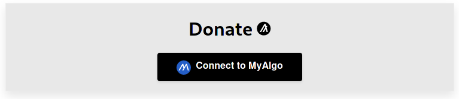
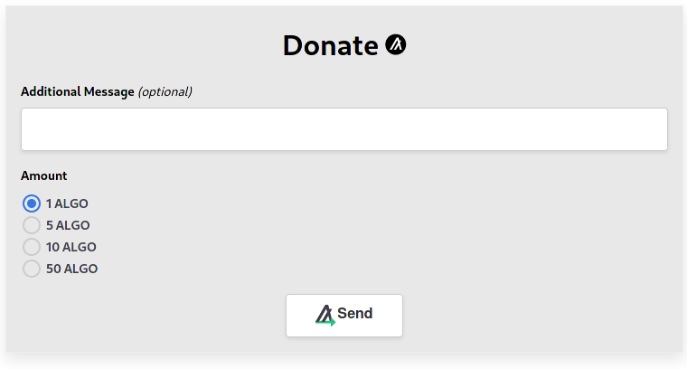
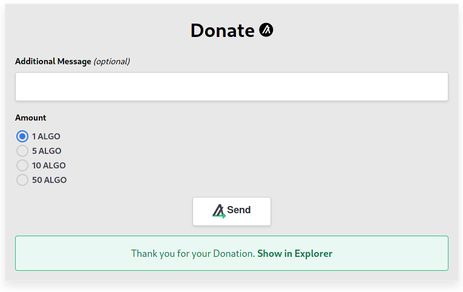

[](https://app.netlify.com/sites/algorand-donation-app/deploys)
[[!License: MIT](https://img.shields.io/apm/l/atomic-design-ui.svg?)](LICENSE.txt)

# A Donation App using Algorand and Pipeline-UI
This Donation App uses Pipeline-UI to allow visitors of the website to donate Algo.

Deployed version: ![https://algorand-donation-app.netlify.app/]

## Security notice
This project is **not** audited and should not be used in a production environment as is.

## Set up the project
After cloning the repository install the dependencies using npm and start the development server:

```bash
git clone ...
cd algorand-donation-app
npm install
npm run start
```

You might want to change the receiverAddress in src/App.js.

It is also possible to build the application to static files which can then be served by a webserver:
```bash
npm run build
```

## Architecture
The application is split into two components:

- src/App.js: General page layout and displays the AlgoDonate component
- src/AlgoDonate.js: Contains everything related to donating

## How it works
The AlgoDonate component only displays the AlgoButton component, which the user can use to connect his MyAlgo wallet. 



After connecting his address is stored in the `address` state variable and the AlgoButton is replaced by multiple input fields. Whenever the message text input or the radio button change the respective state value `msg`/`amount`is updated. For the input fields the Components Field, Radio, Box and Input are used.



Once the user clicks the AlgoSendButton the information is taken from the state variables and the user is shown a myAlgo popup by the AlgoSendButton. After signing the transaction the `txID` state variable is set and a thank you message is shown to the user containing a link to algoexplorer via a Flash component.


